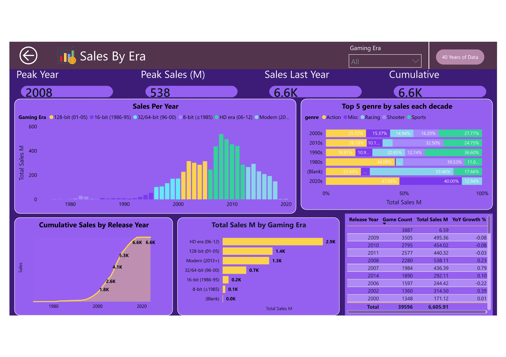
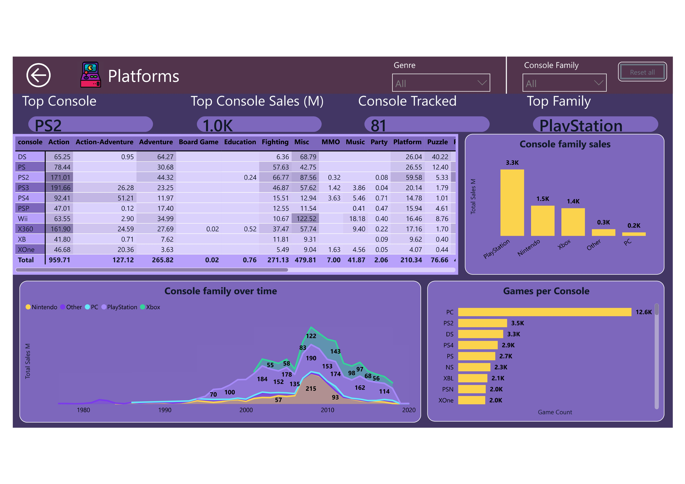
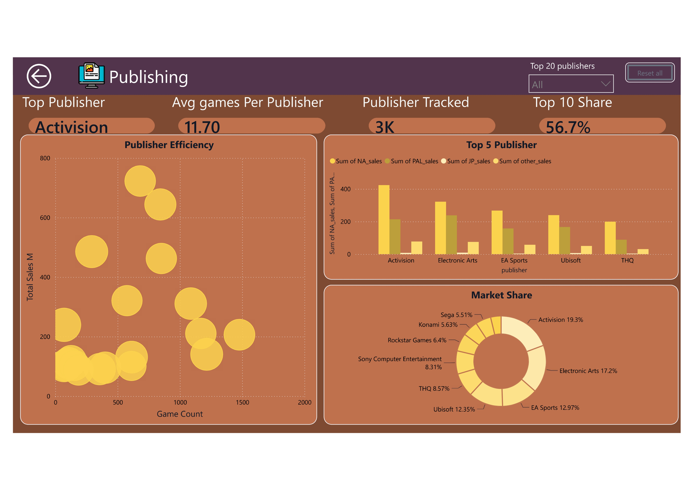
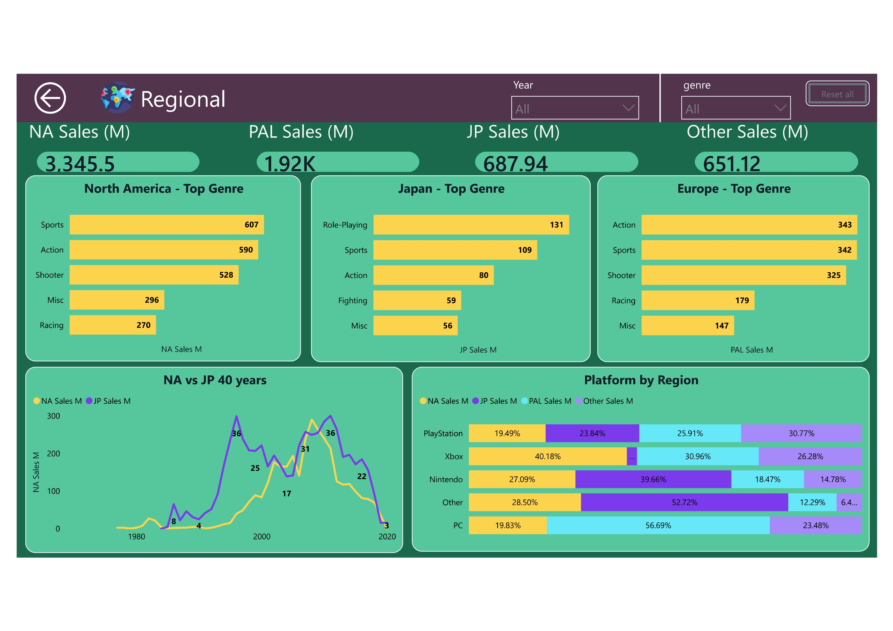
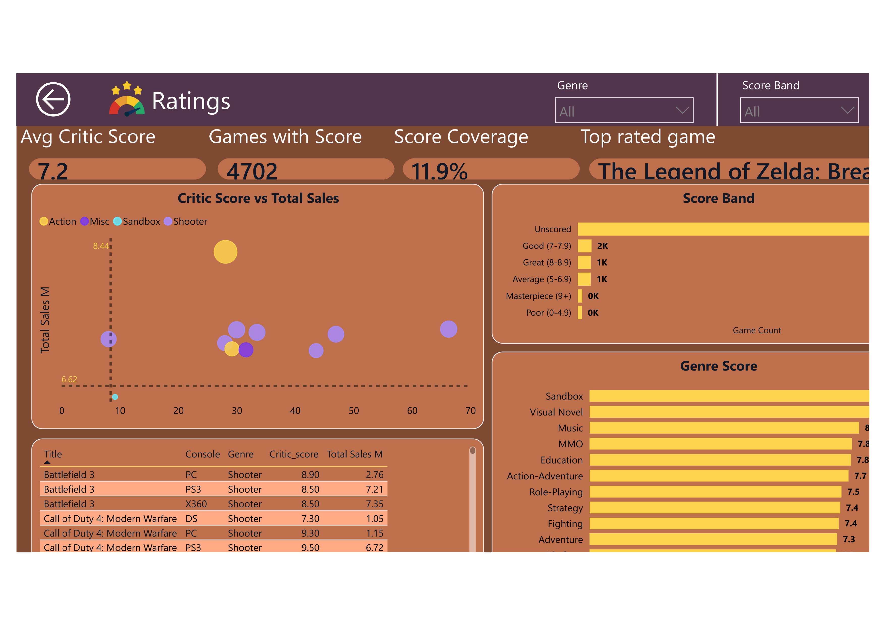

# GameVault — Video Game Sales Analytics Dashboard

### Transforming 40+ Years of Gaming Data into Actionable Business Insights

Interactive Business Intelligence dashboard built with **Power BI**, featuring advanced analytics, dynamic visualizations, KPI reporting, and data storytelling.

---

# 📸 Dashboard Preview

> **Executive Overview Dashboard**

<p align="center">

</p>

GameVault is an interactive Business Intelligence solution designed to analyze global video game sales between **1980 and 2024**. The dashboard enables stakeholders to explore industry trends, compare publisher performance, evaluate regional markets, and identify key business opportunities through dynamic visualizations.

---

# Key Features

* Executive KPI Dashboard
* Platform Performance Analysis
* Regional Sales Insights
* Publisher Comparison
* Genre Performance Analytics
* Critic Score Analysis
* Historical Sales Trends
* Interactive Filters & Drill-through
* Optimized DAX Measures
* Modern UI/UX Design

---

# Technology Stack

| Category            | Technologies                 |
| ------------------- | ---------------------------- |
| BI Platform         | Power BI Desktop             |
| Data Transformation | Power Query                  |
| Data Modeling       | Star Schema                  |
| Calculations        | DAX                          |
| Data Source         | CSV / Excel                  |
| Visualization       | Interactive Power BI Reports |

---

# Dashboard Pages

# Dashboard Navigation

The dashboard is designed to guide users through a complete analytical workflow.

Home
  │
  ├── Executive Overview
  │
  ├── Sales Analysis
  │
  ├── Platform Analysis
  │
  ├── Genre Analysis
  │
  ├── Publisher Analysis
  │
  ├── Regional Analysis
  │
  └── Ratings Analysis
---

## Executive Overview

The landing page provides an executive summary of the gaming industry using high-level KPIs and interactive navigation.

### Highlights

* Executive KPIs
* Industry Overview
* Navigation Menu
* Dynamic Filters
* Summary Visualizations

<p align="center">

</p>

---

## Sales Trend Analysis

Analyze global video game sales over four decades to identify growth patterns and market evolution.

    ### Insights
    
    * Annual Sales Trend
    * Sales Growth
    * Best Performing Years
    * Historical Comparison
    
    <p align="center">
    
    </p>
    
    ---

## Platform Analysis

Compare gaming platforms based on sales performance and market dominance.

    ### Highlights
    
    * Platform Rankings
    * Lifetime Sales
    * Market Share
    * Platform Comparison
    
    <p align="center">
    
    </p>

---

## Genre Analysis

Understand which genres consistently drive sales and player engagement.

    ### Highlights
    
    * Genre Popularity
    * Revenue Distribution
    * Market Trends
    * Best Performing Genres
    
    <p align="center">
    
    </p>

---

## Publisher Analysis

Evaluate leading publishers and compare their commercial success.

    ### Highlights
    
    * Publisher Rankings
    * Total Sales
    * Market Share
    * Top Selling Publishers
    
    <p align="center">
    
    </p>

---

## Regional Analysis

Explore how different regions contribute to worldwide game sales.

    ### Highlights
    
    * Regional Comparison
    * Market Distribution
    * Geographic Trends
    * Regional Revenue
    
    <p align="center">
    
    </p>

---

## Ratings Analysis

Investigate the relationship between critic scores and commercial success.

    ### Highlights
    
    * Critic Ratings
    * Score Distribution
    * Rating vs Sales
    * Popular Titles
    
    <p align="center">
    
    </p>

---

# Business Questions Answered

This dashboard helps answer questions such as:

* Which gaming platforms generated the highest sales?
* Which publishers dominate the industry?
* How have video game sales evolved over time?
* Which genres consistently outperform others?
* Which regions contribute the highest revenue?
* Do higher critic ratings correlate with stronger sales?
* What long-term trends can support strategic business decisions?

---

# Business Value

The dashboard empowers decision-makers by enabling them to:

* Monitor industry growth
* Evaluate publisher performance
* Compare gaming platforms
* Identify high-performing genres
* Analyze regional demand
* Support strategic planning through data-driven insights

---

# Skills Demonstrated

This project showcases practical Business Intelligence and analytics skills, including:

* Data Cleaning
* Data Transformation
* Data Modeling
* Star Schema Design
* DAX Measures
* KPI Development
* Dashboard Design
* Interactive Reporting
* Data Storytelling
* Business Intelligence
* Visual Analytics

---

# Repository Structure

GameVault/
│
├── Dashboard.pbix
├── README.md
├── LICENSE
│
├── Dataset/
│   └── video-game-sales.csv
│
├── docs/
│   ├── home.png
│   ├── sales-analysis.png
│   ├── platform-analysis.png
│   ├── genre-analysis.png
│   ├── publisher-analysis.png
│   ├── regional-analysis.png
│   └── ratings-analysis.png
│
└── Assets/
    └── Logo.png
```

---

# Getting Started

### Clone Repository

```bash
git clone https://github.com/Username/GameVault.git
```

### Open the Project

1. Install **Power BI Desktop**
2. Open `Dashboard.pbix`
3. Refresh the dataset
4. Explore the interactive reports

---

# Future Improvements

* Forecasting Models
* AI-Powered Insights
* Row-Level Security (RLS)
* Mobile Optimized Layout
* Power BI Service Deployment
* Incremental Refresh
* Drill-through Reports
* Tooltip Pages

---

# Author

**Smit Patel**

Data Analyst • Business Intelligence Developer • Power BI Developer

* GitHub: https://github.com/patelsmit515


---

<div align="center">

⭐ **If you found this project interesting, consider giving it a star!**

</div>
